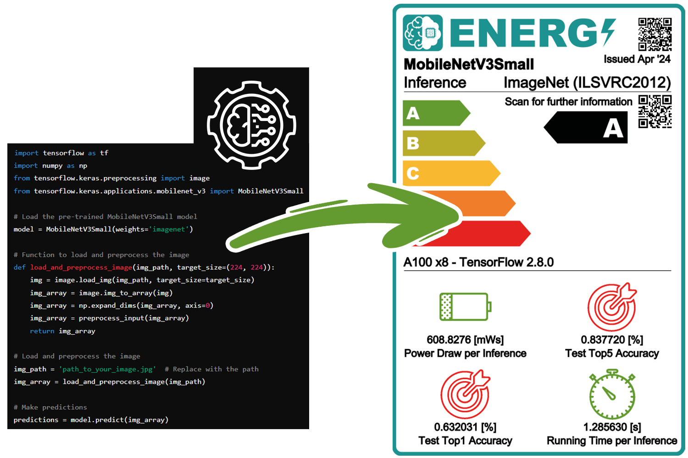
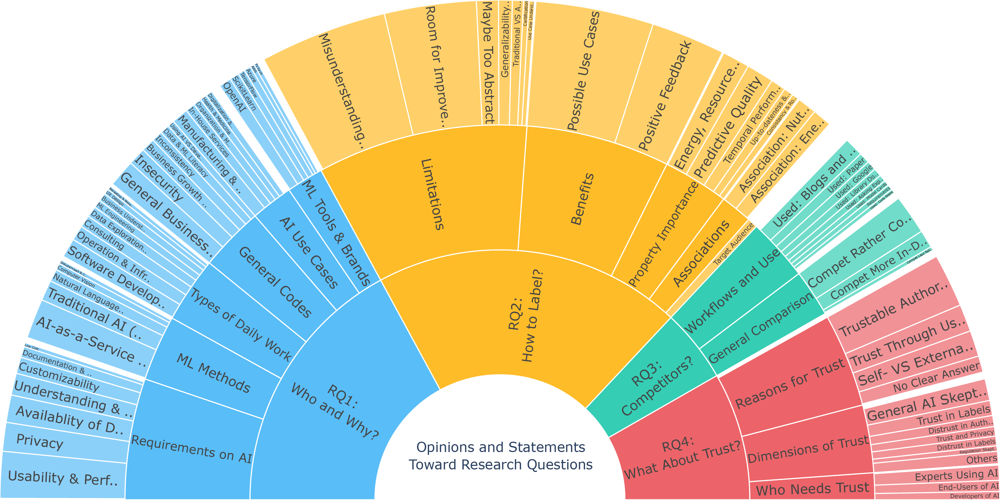

# 🏷️ Evaluating AI Labeling Practices for Trustworthy AI Development (AIES '25)

Our research suggests that AI labels can bridge communication gaps, promote trust, and act as a lever for sustainable development!



This repository contains additional materials for our respective evaluation study, which is forthcoming at the [AAAI/ACM Conference on AI, Ethics, and Society](https://www.aies-conference.com/2025/) and was already [published as a preprint](https://arxiv.org/abs/2501.11909). 

Do you want to know more about our study? Check out our [Blog post](https://lamarr-institute.org/blog/ai-labels-for-trust/)! If you want to learn more about the concepts of AI labels, you can also read into Chapter 4 of [Raphael Fischer's PhD thesis](https://doi.org/10.17877/DE290R-25716).

## ⚙️ Methods
We generated the labels with the [STREP framework](https://github.com/raphischer/strep) and conducted semi-structured interviews with practitioners, based on an [open interview call](https://lamarr.cs.tu-dortmund.de/ml-label-interviews/). In particular, our study has the goal of answering four central research questions:
- Who is interested in AI labeling and what are their problems with using or developing AI? (RQ1)
- What are the practical benefits and limitations of labeling AI model behavior? (RQ2)
- How are AI labels perceived in comparison to other forms of reporting? (RQ3)
- How do AI labels and the corresponding certifying authority affect the trustworthiness of AI systems? (RQ4)
Based on the interview transcripts, we performed a thematic analysis with [MAXQDA](https://www.maxqda.com/) and derived an extensive hierarchical code system over several iterations:



## 📂 Repository Structure
```bash
├── analysis/        # Out analysis results (machine-readable)
├── materials/       # Used in our study, like the interview guide
├── scripts/         # Python scripts for the analysis and plotting
├── paper_results/   # Tables and plots generated for the paper
├── .gitignore       # Excluding certain files (non-anonmyized data)
├── README.md        # You are here 🚀
```

## 💡 Insights
Our study shows that there is a real need for simplified representations of AI. Labels can serve as a bridge between experts and users, reduce misunderstandings, and facilitate employee involvement. Especially for user groups without technical knowledge, AI labels offer quick access to relevant information and thus support responsible and reflective AI usage.

The main challenge is to present information in an understandable way without losing important technical detail. Since different user groups require different types of information, a “one-size-fits-all” AI label is not sufficient. AI Labels should therefore be designed to be interactive, so that each audience can access the information that is most relevant to them. In addition, AI labels should be linked to other reporting formats, allowing interested users to explore more deeply, which could enhance both the effectiveness and trustworthiness of the labels. Furthermore, AI labels are not only informative. They can also guide decision-making by highlighting certain performance aspects of models. In the context of sustainability, for example, labels could help shift the focus away from pure performance and toward environmental concerns.

In summary, the AI labels were well-received by participants and received a lot of positive feedback. However, they still need to be improved and refined in line with the points mentioned, so that their full potential can be achieved by all user groups. 

## 📝 Citing

If you appreciate our work, please cite the following literature:

```
Fischer, R., Wischnewski, M., van der Staay, A., Poitz, K., Janiesch, C. & Liebig, T. Bridging the Communication Gap: Evaluating AI Labeling Practices for Trustworthy AI Development. Proceedings of the Eighth AAAI/ACM Conference on AI, Ethics, and Society (AIES) (2025) (forthcoming). https://doi.org/10.48550/arXiv.2501.11909

Fischer, R. Advancing the Sustainability of Machine Learning and Artificial Intelligence via Labeling and Meta-Learning.
Ph.D. Dissertation, TU Dortmund University (2025). https://doi.org/10.17877/DE290R-25716

Fischer, R., Liebig, T. & Morik, K. Towards More Sustainable and Trustworthy Reporting in Machine Learning. Data Mining and Knowledge Discovery 38, 1909–1928 (2024). https://doi.org/10.1007/s10618-024-01020-3
```


You can also use the following BibTex entries:
```bibtex
@inproceedings{fischer_interview,
author = {Raphael Fischer and Magdalena Wischnewski and Alexander van der Staay and Katharina Poitz and Christian Janiesch and Thomas Liebig},
title = {Bridging the Communication Gap: Evaluating AI Labeling Practices for Trustworthy AI Development},
year = {2025},
publisher = {AAAI Press},
booktitle = {Proceedings of the Eighth AAAI/ACM Conference on AI, Ethics, and Society},
series = {AIES '25},
note = {(forthcoming)},
url = {https://arxiv.org/abs/2501.11909},
doi = {10.48550/arXiv.2501.11909},
}

@phdthesis{fischer_diss,
  title={Advancing the Sustainability of Machine Learning and Artificial Intelligence via Labeling and Meta-Learning},
  author={Fischer, Raphael},
  school={TU Dortmund University},
  url={http://doi.org/10.17877/DE290R-25716},
  doi={10.17877/DE290R-25716},
  year={2025}
}

@article{fischer_dami,
	title = {Towards More Sustainable and Trustworthy Reporting in Machine Learning},
	volume = {38},
	issn = {1573-756X},
	url = {https://doi.org/10.1007/s10618-024-01020-3},
	doi = {10.1007/s10618-024-01020-3},
	number = {4},
	journal = {Data Mining and Knowledge Discovery},
	author = {Fischer, Raphael and Liebig, Thomas and Morik, Katharina},
	year = {2024},
	pages = {1909--1928},
}
```

Copyright (c) Raphael Fischer (2025)